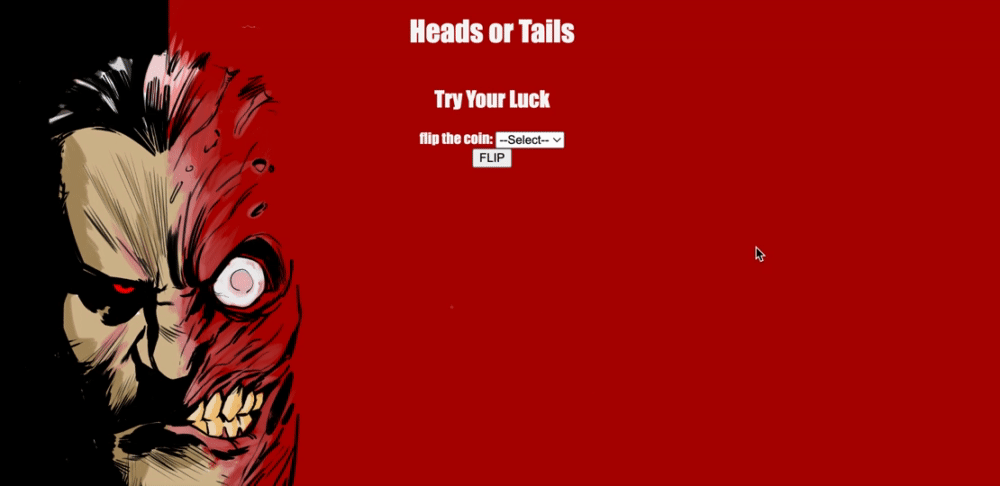

# Heads or Tails?: <a target="_blank" href="https://heads-or-tails-jamesphi.netlify.app/">Visit Here</a>

## Tech used: 
This simple heads or tails coin flip game uses node.js to have the functions run on the backend.
## Optimizations

THis app is pretty simple but perhaps I could've added an animation for aesthetic purposes.

## Lessons Learned:

This increased my familiartiy with Node.js and changing functionality to the backend. Reinforced the Separation of Concerns. 
